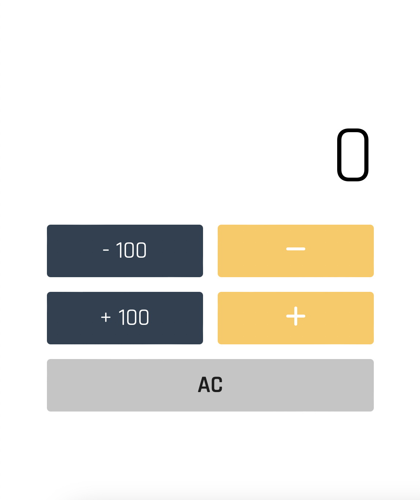

Overview
----------------------

Si tratta di una semplice applicazione che funziona come un counter.  
Essa permette di:
- Incrementare di 1 il valore del numero mostrato (settato a zero);
- Diminuire di 1 il valore del numero mostrato;
- Aumentare di 100 il valore del numero;
- Diminuire di 100 il valore del numero;
- Resettarlo a 0 (zero) tramite il pulsante "AC".

 